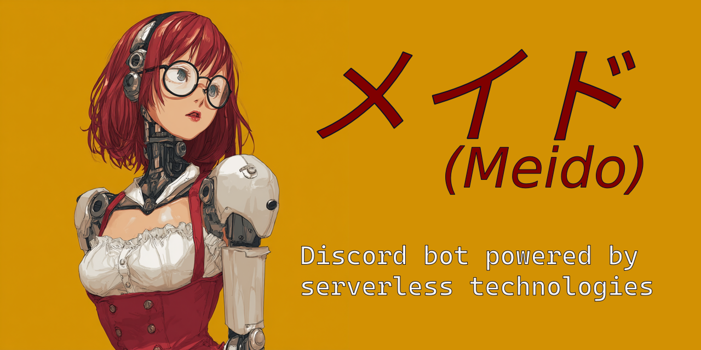

# メイド (Meido)



- [メイド (Meido)](#メイド-meido)
  - [❓ Can Discord bots be built using serverless technologies?](#-can-discord-bots-be-built-using-serverless-technologies)
  - [🧩 Modules](#-modules)
    - [⚙ Core Module](#-core-module)
    - [🏠 ただいま (tadaima) module](#-ただいま-tadaima-module)
  - [🛠 Local Development](#-local-development)
    - [📦 Prerequisites](#-prerequisites)
    - [🔧 Setup](#-setup)
  - [🚀 Deploying the Bot](#-deploying-the-bot)

## ❓ Can Discord bots be built using serverless technologies?

Absolutely — this project is a proof-of-concept Discord bot built entirely with AWS Lambda, EventBridge, and DynamoDB. It leverages Discord’s interaction endpoint to handle slash commands without maintaining a gateway connection.

⚠️ **Note:** This architecture has trade-offs. Real-time gateway events like message reactions or member updates are unavailable, and all interactions must be responded to within strict timeouts.

## 🧩 Modules

### ⚙ Core Module

The **Core Module** is the central entry point and shared infrastructure for the bot.

> See [module docs](src/core/README.md) for more details.

<!-- TODO: include core module docs -->

---

### 🏠 ただいま (tadaima) module

A minimal proof-of-concept command that respods to `/tadaima` command. Served as test for the bot's infrastructure and interaction handling along withthe CDK custom resource for command registration.

> See [module docs](src/tadaima/README.md) for more details.

<!-- TODO: include tadaima module docs -->

---

## 🛠 Local Development

### 📦 Prerequisites

- [Node.js v22](https://nodejs.org/en/download/) - ideally use [`nvm`](https://nvm.sh/) and install thhe required version specified in `.nvmrc` with `nvm install`
- [PNPM](https://pnpm.io/) - install globally with `npm install -g pnpm`
- [AWS CLI](https://aws.amazon.com/cli/) and configured credentials

### 🔧 Setup

1. Clone the repository:

   ```bash
   git clone https://github.com/Malanius/meido-bot.git
   ```

1. Install dependencies:

   ```bash
   npx projen install
   ```

## 🚀 Deploying the Bot

All CDK stacks follow the format: `${env}/${module-name}`, `env` is taken from environment variable `APP_ENV` (default is `dev`), and `module-name` is the name of the module (e.g., `core`, `tadaima`).

1. **Configure AWS credentials**

   ```bash
   aws configure [--profile <profile-name>]
   ```

1. **Configure AWS region**  
   Ensure your AWS CLI is configured to use the correct region where you want to deploy the bot.
   Stacks are region-less and will deploy to the region set in your AWS CLI configuration. You can set the region by exporting the `AWS_REGION` environment variable:

   ```bash
   export AWS_REGION=eu-west-1  # or your preferred region
   ```

1. **Bootstrap CDK** in the account and region you want to deploy (required only once per account/region):

   ```bash
   npx cdk bootstrap
   ```

1. **Set the environment variable for the deployment environment**  
   This is used to determine which CDK stacks to deploy. For example, to deploy to the development environment:

   ```bash
   export APP_ENV=dev
   ```

1. **Deploy the Core Module**  
   This must be done first, as all other modules depend on shared resources.

   ```bash
   cdk diff dev/core
   cdk deploy dev/core
   ```

1. **Configure Discord Secrets**  
   After deploying the core module, populate required Discord credentials (e.g., bot token, public key) into AWS Secrets Manager. These must be in place before deploying any command modules.

   ```json
   {
       "appId": "Your application ID",
       "publicKey": "Your application public key",
       "botToken": "Your bot token",
       "guildId": "Optional, Guild ID for which the bot is enabled"
   }
   ```

1. **Configure interaction handler URL**  
   After deploying the core module, set the interaction handler URL in your Discord application settings to the Lambda function URL provided by the core module. This is necessary for Discord to route interactions to your bot.

   - Go to your [Discord Developer Portal](https://discord.com/developers/applications)
   - Select your application
   - Navigate to the "Bot" section
   - Set the "Interaction Endpoint URL" to the Lambda function URL from the core module deployment output

1. **Deploy Command Modules**
   For each command module, run:

   ```bash
   cdk diff dev/<module-name>
   cdk deploy dev/<module-name>
   ```

   For example, to deploy the Ping module:

   ```bash
   cdk diff dev/ping
   cdk deploy dev/ping
   ```

   Each command module will register its slash command with Discord during deployment via a CDK custom resource.
