# 🧩 Core Module

The **Core Module** is the central entry point and shared infrastructure for the bot. It handles incoming interactions, signature verification, and provides the plumbing to route both Discord interactions and database changes via EventBridge.

## Responsibilities

- **Signature & input handling**  
  - `InteractionHandler` Lambda verifies Discord request signatures  
  - Responds to PINGs inline
  - defers slash commands

- **Event routing**  
  - Publishes all non-PING interactions to **EventBridge** (`EventBus`) with  
    `source = "dev.malanius.meido.interactions"`  
  - Universal **Stream→EventBridge bridge** Lambda:  
    - Triggered by **DynamoDB Streams** on the core `Database` (NEW_AND_OLD_IMAGES)  
    - Parses each record’s PK/SK to infer `<module>#<entity>#<id>` and action (`INSERT`/`MODIFY`/`REMOVE`)  
    - Emits an EventBridge event with  
      - `source = "dev.malanius.meido.database"`  
      - `detailType = "<module>.<entity>.<SemanticAction>"`  
      - `detail` containing image data  

- **Shared state storage**  
  - Single‐table DynamoDB (`Database`)  
  - PK/SK pattern `<module>#<entity>#<id>` for all modules to share  
  - Streams enabled (NEW_AND_OLD_IMAGES) for cross‐module triggers

## Components

- **Lambda:** `InteractionHandler` - uses Lambda function URL for receiving events from Discord
- **SecretsManager**: `DiscordSecrets`: - fill this after core stack creation, used for command registration while deploying commands modules

    ```json
    {
        "appId": "Your application ID",
        "publicKey": "Your application public key",
        "botToken": "Your bot token",
        "guildId": "Otional, Guild ID for which the bot is enabled"
    }
    ```

- **EventBridge Bus:** `EventBus` - received commands are deferred and routed to event bus for processing by their respective modules
- **DynamoDB Table:** `Database` - single table provided for rest of the modules, not directly used by core
- **Lambda** `DynamoBridge` - parses and forwards DynamoDB stream events to event bus

## Architecture

```mermaid
architecture-beta
    service discord(logos:discord-icon)[Discord]

    group core(logos:aws)[Core]
    service db(logos:aws-dynamodb)[Database] in core
    service handler(logos:aws-lambda)[Interactions Handler] in core
    service secret(logos:aws-secrets-manager)[Discord Secret] in core
    service bus(logos:aws-eventbridge)[Event Bus] in core
    service dynamoBridge(logos:aws-lambda)[Stream Bridge] in core

    discord:R --> L:handler
    handler:T --> B:secret
    handler:L --> R:discord
    handler:R --> L:bus
    db:R --> L:dynamoBridge
    dynamoBridge:T --> B:bus
```


