# 🧩 Core Module

The **Core Module** is the central entry point and shared infrastructure for the bot.

## Responsibilities

- Verify Discord request signatures
- Respond to `PING` interactions inline
- Defer other interactions and dispatch them via EventBridge
- Provide shared state storage via a single-table DynamoDB
- Route command events to appropriate feature modules

## Components

- **Lambda:** `InteractionHandler` - uses Lambda function URL for receiving events from Discord
- **SecretsManager**: `DiscordSecrets`: - fill this after core stack creation, used for command registration while deploying commands modules

    ```json
    {
        "appId": "Your application ID",
        "publicKey": "Your application public key",
        "botToken": "Your bot token",
        "guildId": "Otional, Guild ID for which the bot is enabled"
    }
    ```

- **EventBridge Bus:** `EventBus` - received commands are deffered and routed to event bus for processing by their respective modules
- **DynamoDB Table:** `Database` - single table provided for rest of the modules, not direclty used by core

## Architecture

```mermaid
architecture-beta
    service discord(logos:discord-icon)[Discord]

    group core(logos:aws)[Core]
    service db(logos:aws-dynamodb)[Database] in core
    service handler(logos:aws-lambda)[Interactions Handler] in core
    service secret(logos:aws-secrets-manager)[Discord Secret] in core
    service bus(logos:aws-eventbridge)[Event Bus] in core

    discord:R --> L:handler
    handler:T --> B:secret
    handler:L --> R:discord
    handler:R --> L:bus
```


