```mermaid
architecture-beta
    service discordi(logos:discord-icon)[Discord]
    service discordo(logos:discord-icon)[Discord]

    group core(logos:aws)[Core]
    service db(logos:aws-dynamodb)[Database] in core
    service bus(logos:aws-eventbridge)[Event Bus] in core
    service secret(logos:aws-secrets-manager)[Discord secret] in core

    %% Forwarded by InteractionHandler
    discordi:R --> L:bus
    %% Handled by DynamoBridge
    db:T --> B:bus

    group journal(logos:aws)[Journal]
    service subhandler(logos:aws-lambda)[Subscription Handler] in journal
    service broadcaster(logos:aws-lambda)[Broadcaster] in journal
    junction secrets in journal
    junction events in journal

    bus:R -- L:events
    subhandler:L --> R:db
    db:R --> L:subhandler
    events:R --> L:broadcaster
    events:B --> T:subhandler
    broadcaster:R --> L:discordo
    broadcaster:T -- B:secrets
    secrets:L --> R:secret
```

# 📝 Journal Module

The **Journal module** allows Meido to gracefully announce her newly acquired skills, improvements, and duties. Users may subscribe one channel per server to these updates to be kept informed of Meido’s capabilities as she continues to serve with excellence.

This module is tightly integrated with Meido’s deployment pipeline: each newly published skill update is inserted as a journal entry into DynamoDB, triggering a cascade that notifies all subscribers.

## ✨ Features

- Slash command: `/journal`
  - `subscribe` – subscribes a channel to the journal updates
  - `unsubscribe` – removes a channel from updates
  - `info` – view current subscription status
- Journal entries inserted via CDK or custom resource
- EventBridge-based broadcasting of new skills to all subscribers
- Supports user- and channel-level subscriptions

## 💬 Example Journal Entry

```text
📝 Master-sama has taught me a new skill—how truly wonderful! ✨

From today onward, I am able to maintain a humble improvement journal and announce my newly learned duties to those who wish to be kept informed. 💌

If you would like to receive these updates, you may simply use the command `/journal subscribe`. And if you ever wish to stop receiving them, just use `/journal unsubscribe`. You may also use `/journal info` to see your current subscription status.

I shall do my very best to keep you updated! 

```

## 🧩 Components

- **Lambda Function** `SubscriptionHandler`
  - handles the `/journal` command interactions
  - stores subscription data in database
- **Lambda Function** `Broadcaster`
  - triggered by new journal entry being inserted into database
  - reads subscriptions from database
  - sends the new journal entry update to all subscribers

## 🏗 Architecture


