# 🔂 Ping Module

A minimal proof-of-concept command that respods to `/ping` command. Served as test for the bot's infrastructure and interaction handling along with the CDK custom resource for command registration.

## Features

- Responds to `/ping` with “🏓 Pong!” with time took to respond (cold starts are very noticable)
- Uses follow-up messaging via the interaction token, token is enough to respond to the interaction without having to read secrets
- Serves as a template for other command modules

## Components

- **Lambda Function** `PingHandler` - Responds to the `/ping` command interaction

## Architecture

```mermaid
architecture-beta
    group core(logos:aws)[Core]
    service bus(logos:aws-eventbridge)[Event Bus] in core

    group ping(logos:aws)[Ping]
    service handler(logos:aws-lambda)[Ping Handler] in ping

    service discord(logos:discord-icon)[Discord]

    bus:R --> L:handler
    handler:R --> L:discord
```

