# 🏠 ただいま (tadaima) module

A minimal proof-of-concept command that responds to `/tadaima` command. Served as test for the bot's infrastructure and interaction handling along with the CDK custom resource for command registration.

## Features

- Responds to `/tadaima` with greeting "Welcome home!" with time took to respond
- If called by master user, adds "master" to the reply
- Reports cold starts on interaction endpoint and command handler
- Has small chance to respond in Japanese
- Uses follow-up messaging via the interaction token, token is enough to respond to the interaction without having to read secrets
- Serves as a template for other command modules

## Components

- **Lambda Function** `TadaimaHandler` - Responds to the `/tadaima` command interaction

## Architecture

```mermaid
architecture-beta
    group core(logos:aws)[Core]
    service bus(logos:aws-eventbridge)[Event Bus] in core

    group tadaima(logos:aws)[Tadaima]
    service handler(logos:aws-lambda)[Tadaima Handler] in tadaima

    service discord(logos:discord-icon)[Discord]

    bus:R --> L:handler
    handler:R --> L:discord
```

